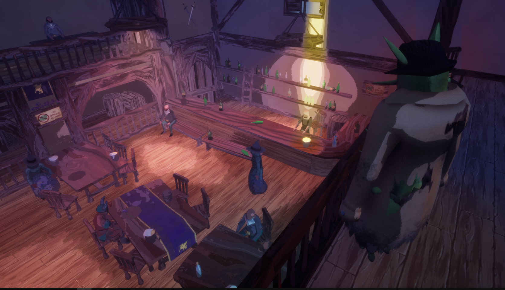
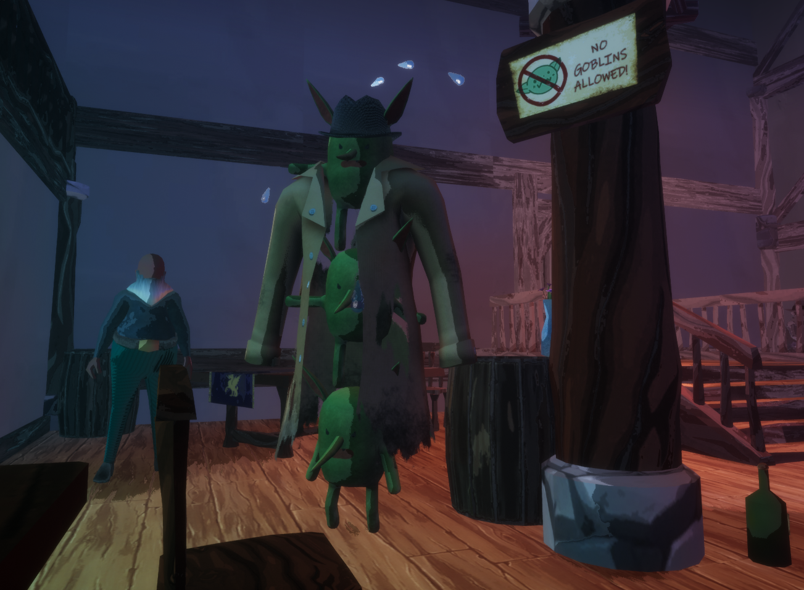

# The-Three-Goblin-Problem
Entry for Ludum Dare 49 game jam

Joined up with four of my friends and made a short game in 3 days.

Excluding the game engine (Unreal Engine 4), some sound effects (public domain), and the game over jingle (credited below), everything else (including character and environment models, music, 2D art) was made from scratch for this project.

# Download
 https://ldjam.com/events/ludum-dare/49/$265069
 
 https://blackflicka.itch.io/the-three-goblin-problem

# CREDITS
pfs: Music (Main Theme), Programming

Dobrila: Programming

toreskovic: Lighting, Programming, UI

burst: Game Design, Environment Modelling and Texturing, Level Design, Music (Noir Mode), Particles, Programming

yugeen: Character Models, Character Animations, Character Texturing

Copyright/Attribution Notice: Game Over Theme by Cleyton Kauffman - https://soundcloud.com/cleytonkauffman MORT VS ZUGHY PALETTE Created by Purple Fruit by combining Softmilk 32 by MortMort and Zughy32 by Zughy
